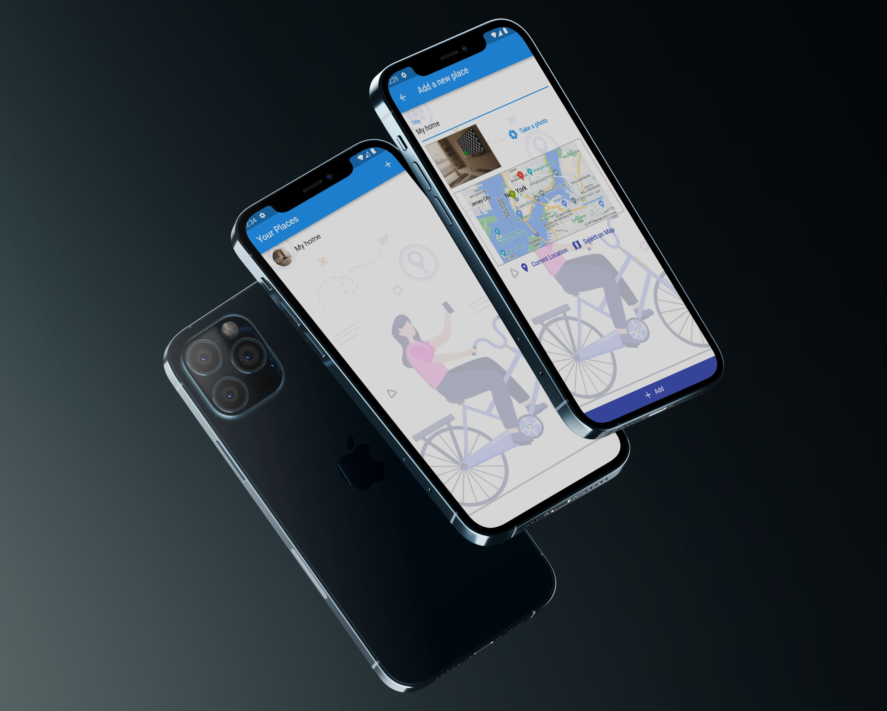
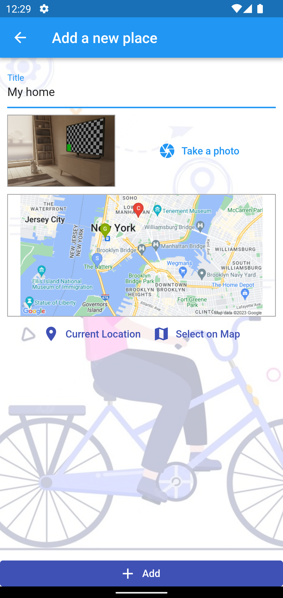
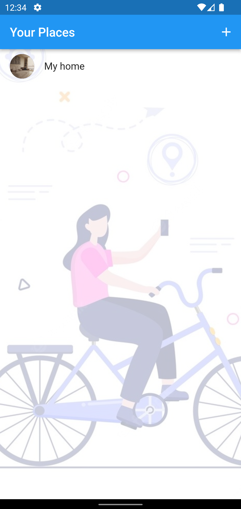

<h1 align="center">
   
  
Favorite Places
   
</h1>

<h4 align="center">Favorite Places app built on top of <a href="https://flutter.dev/" target="_blank" style="color:##0276E8;">Flutter</a>.</h4>

## Table of Contents
* [Mockup](#mockup)
* [Screenshots](#screenshots)
* [About the Project](#about-the-project)
* [Key Features](#key-features)
* [Built With](#build)
* [Contact](#contact)

## Mockup

  

## Screenshots 

  
  

## About the project

* **State management**: Provider.
* **Backend connection**: Google Map Api, sqflite.

## Key Features

• Take photos with camera
• Add Location
• Name the Location
• Save it to your phone 
• Get a collection of your favorite places 

## Built With

This software uses the following packages:

- [Flutter](https://flutter.dev/)
- [Dart](https://dart.dev/)
- [Visual Studio Code](https://code.visualstudio.com/)

## Contact

>  - [GitHub](https://github.com/AnikKazi-dev) 
>  - [LinkedIn](https://www.linkedin.com/in/kazi-anik-7a2978172/)
